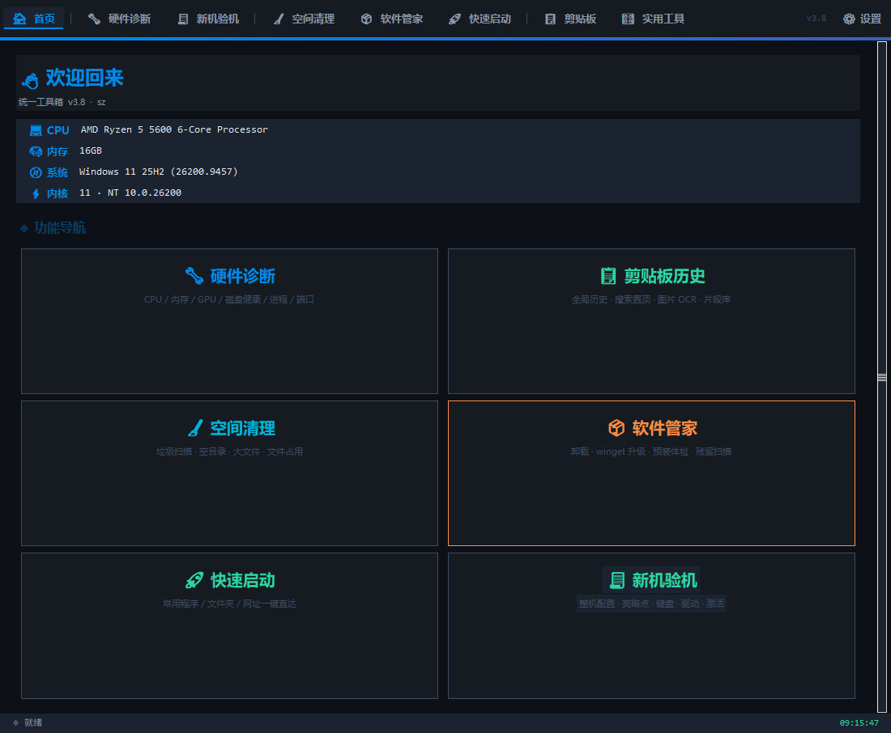
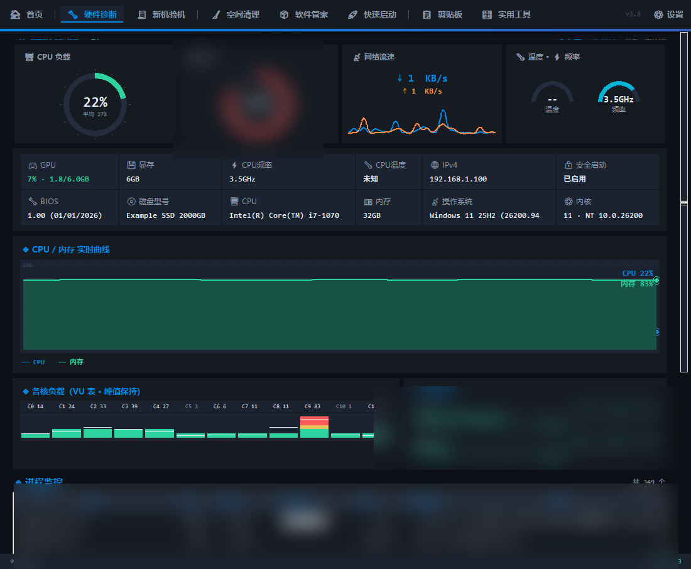
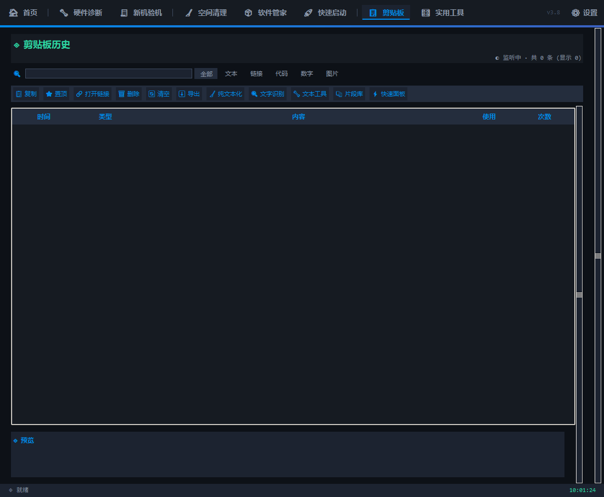
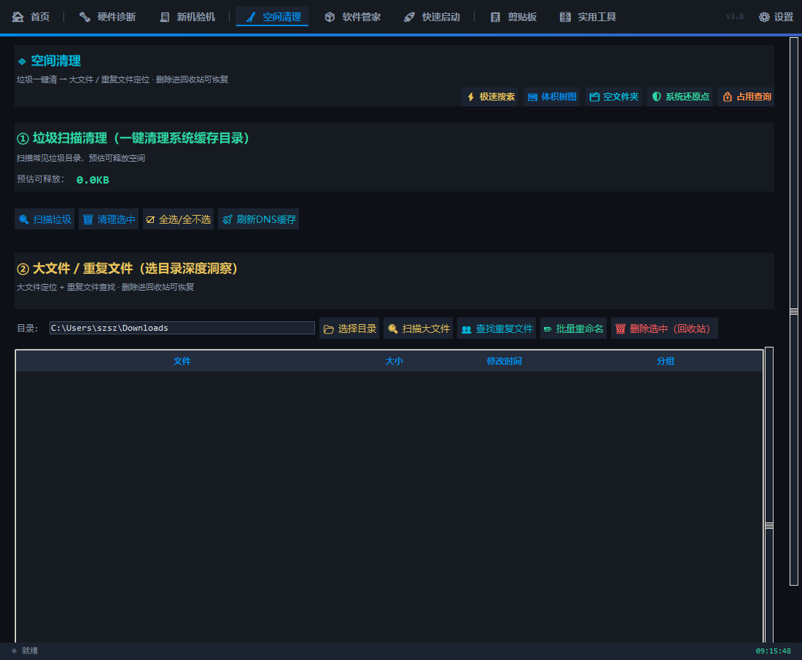
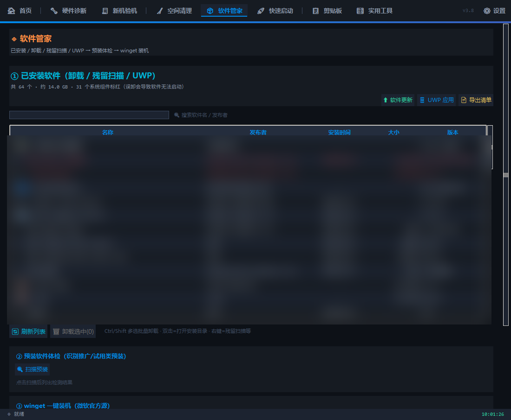
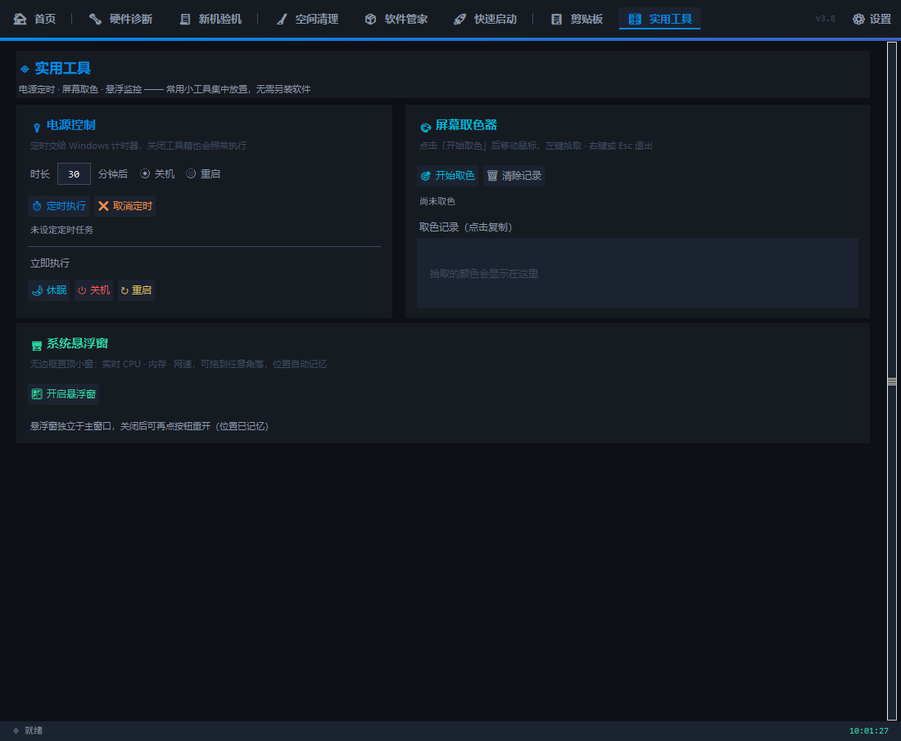
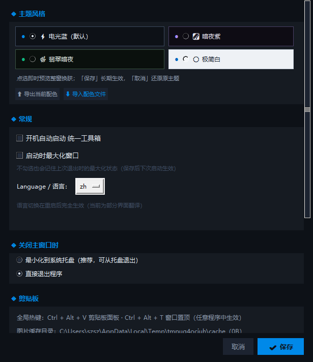

<div align="center">

# 统一工具箱 · Unified Toolbox

**一款免安装的 Windows 桌面工具箱：硬件诊断、剪贴板增强、磁盘清理、软件卸载、文件洞察、快速启动 —— 全部装进一个 19MB 的 exe。**

[](../../releases)
[](#-快速开始)
[](#%EF%B8%8F-从源码运行开发)
[](#%EF%B8%8F-开发与测试)

**[下载最新版](../../releases/latest)** · [功能一览](#-功能一览) · [使用说明](#-使用说明) · [从源码运行](#%EF%B8%8F-从源码运行开发)

</div>

---

## 截图

| 首页 | 硬件诊断 |
|---|---|
|  |  |

| 剪贴板 | 空间清理 |
|---|---|
|  |  |

<details>
<summary>更多截图（软件管家 / 实用工具 / 设置中心）</summary>

| 软件管家 | 实用工具 |
|---|---|
|  |  |



</details>

## ✨ 功能一览

| 模块 | 能做什么 |
|---|---|
| 🩺 **硬件诊断** | CPU/内存/GPU 实时仪表、各核负载（VU 表 + 峰值保持）、网络流速曲线、磁盘 SMART 健康与通电时长、启动项、进程监控（可直接结束进程）、端口占用查询 |
| 📋 **剪贴板** | 全局历史（文本 + 图片）、搜索/置顶/分类过滤、图片 OCR 文字识别、纯文本化、文本工具（编码转换/去重/正则清洗）、片段库、快速粘贴面板（`Ctrl+Alt+V` 全局呼出，回车直接粘贴回原窗口） |
| 🧹 **空间清理** | 系统垃圾扫描（**白名单目录 + 审计日志**，最近 1 小时内修改过的文件自动跳过）、空目录查找与清理、大文件、目录体积树图、极速全文搜索（自建索引）、文件占用查询（Windows Restart Manager）、系统还原点 |
| 📦 **软件管家** | 已装软件卸载、winget 一键升级、预装软件体检（推广/试用类识别）、卸载后残留扫描 |
| ⚡ **快速启动** | 常用程序/文件夹/网址一键直达，双击启动 |
| 🎛 **实用工具** | 系统悬浮窗、定时关机/重启、 magnifier 放大镜等日常小工具 |
| 🧾 **新机验机** | 新机交付前的整体验收清单（配置/磁盘/驱动/激活/坏点/键盘），可导出报告 |
| ⚙ **系统设置** | 主题（4 套实时切换）、开机自启、语言、关闭行为、定时任务、剪贴板隐私、更新源 |

<details>
<summary>各页签截图</summary>

| 空间清理 | 软件管家 | 实用工具 |
|---|---|---|
|  |  |  |

</details>

### 全局热键

| 热键 | 作用 |
|---|---|
| `Ctrl + Alt + V` | 呼出剪贴板快速面板（回车即粘贴回原窗口） |
| `Ctrl + Alt + D` | 跳转剪贴板页 |
| `Ctrl + Alt + T` | 窗口置顶开关 |

## 📦 下载

到 [**Releases**](../../releases/latest) 下载 `UnifiedToolbox.exe`，双击即用。

- **免安装**：不需要 Python，不需要任何运行库
- **单文件**：19MB，放哪都能跑
- **零联网**：所有功能本地完成，不收集任何数据

> 系统要求：Windows 10 / 11（64 位）

## 🚀 快速开始

1. 下载 [`UnifiedToolbox.exe`](../../releases/latest)
2. 双击运行 —— 首次运行会在用户目录创建配置文件
3. 关闭窗口默认**最小化到系统托盘**（可在设置改为直接退出），双击托盘图标恢复

配置文件位置（均可手动删除）：

```
~/.unified_toolbox_settings.json     设置
~/.unified_toolbox_history.json      剪贴板历史（明文，勿存敏感内容）
~/.unified_toolbox_cache\            剪贴板图片缓存
~/.unified_toolbox_clean_log.txt     磁盘清理审计日志
```

## 🔄 在线更新

设置 → 关于 → **更新源**，填入 `owner/repo` 后点「检查更新」：

```
SSshen245/unified-toolbox          GitHub（默认已内置）
gitee:owner/repo                   Gitee（国内直连更快）
```

- 有新版本时会提示下载，下载完成后**自动退出、替换自身并重启**
- **GitHub 被限流时自动改查 Gitee 备用源**（每 IP 每小时只有 60 次匿名额度，
  国内家宽还是和陌生人共享的；限流提示里会写明几点恢复）
- 查询结果缓存 10 分钟，重复点按钮不消耗额度
- 更新源**留空 = 使用内置更新源**；只在点按钮时联网，无后台静默请求

> 更新源换到 Gitee / 对象存储都不用改代码，设置里填一下即可。
> 想启用 Gitee 兜底：在 Gitee 上"从 GitHub 导入"同名仓库，发版后在
> Gitee 的 Release 里上传同名 exe 即可，应用无需任何配置。

## 🛠️ 从源码运行 / 开发

```cmd
:: 1. 建虚拟环境并装依赖（Python 3.11）
python -m venv venv
venv\Scripts\python.exe -m pip install -r requirements.txt

:: 2. 直接跑源码（改完立即生效，不需要打包）
venv\Scripts\python.exe unified\unified.py

:: 3. 跑测试（75 项）
venv\Scripts\python.exe -m unittest discover -s tests

:: 4. 打包 exe
打包.cmd
```

### 一键发版

改完功能要发新版，**双击 `发版.cmd`** 即可，它会依次完成：

```
跑单元测试（不过就中止）→ 自动提交 → 按 APP_VERSION 打 tag
→ PyInstaller 打包 → 生成源码 zip / bundle → 发布到 GitHub Release
```

需要 `gh`（GitHub CLI）并已 `gh auth login`；不想到 GitHub 发布就加 `--no-publish`。

> **注意**：`unified/unified.py` 里的 `APP_VERSION` 必须递增（`v3.7` → `v3.8`），
> 否则老用户点「检查更新」会一直提示"已是最新版本"。

## 📁 项目结构

```
unified/unified.py     全部应用代码（单文件，约 1.06 万行）
tests/                 单元测试（75 项，AST/mock 级）+ 集成检查（6 项）
docs/img/              截图
release.py             一键发版逻辑（被 发版.cmd 调用）
发版.cmd               双击入口：测试 → 提交 → 打 tag → 打包 → 发布
打包.cmd               仅打包 exe
统一工具箱.spec         PyInstaller 配置
使用说明.txt            随 exe 分发的简明说明
```

## 🔒 隐私与安全

- **零联网**：核心功能全部本地完成，不收集、不上传任何数据
- **磁盘清理只动白名单**：目录白名单 + 每次清理写审计日志 + 最近 1 小时内修改过的文件自动跳过
- **残留扫描不误删**：只处理能验证归属的安装目录，不确定的注册表键一律不删
- **激活模块只读**：安装密钥操作需 UAC 管理员确认，且仅限自有授权
- **剪贴板隐私**：疑似密码/令牌自动跳过记录；可设"退出时清空历史"（连图片缓存一起清）

## 🤝 参与

- 发现 bug 或有功能建议，欢迎提 [Issue](../../issues)
- 提交前请跑一遍测试：`venv\Scripts\python.exe -m unittest discover -s tests`

---

<div align="center">

用 Python + Tkinter 手写，无第三方 UI 框架 · [更新日志](../../releases)

</div>
